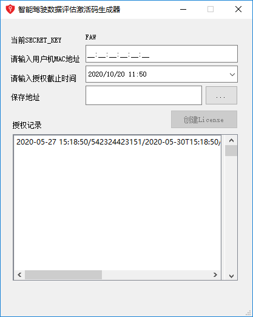
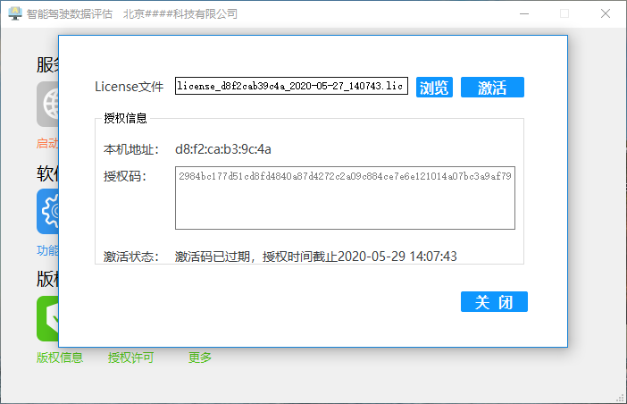

### introduction

Licensing software to specific users.

Designed a license generator software by python.

the software based on following : 

```

pyqt5
Crypto.Cipher
hash

```

### how to use
```json
# first, install all the requirements.
pip install -r requirements.txt

# then, cd to the License_generator
python generate_window.py

# Finally, run the laucher main code.
python launcher.py

```

### release Version

- License generate windows

`generate_window.exe`

- Software launcher named `launcher.exe` which need license file.

### more info






https://jiaruiblog.com/2020/09/28/test-my-site/